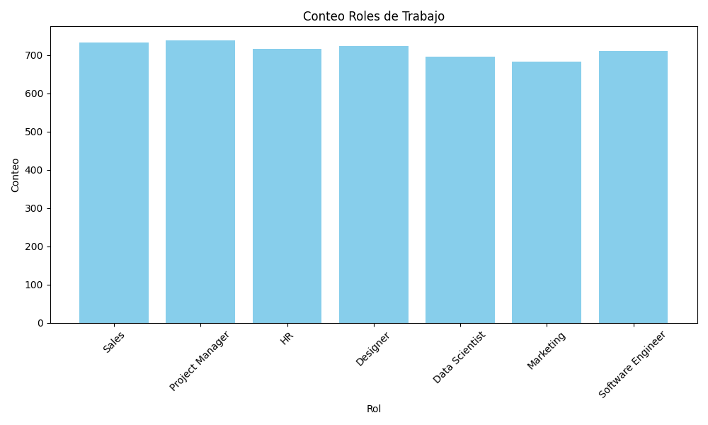
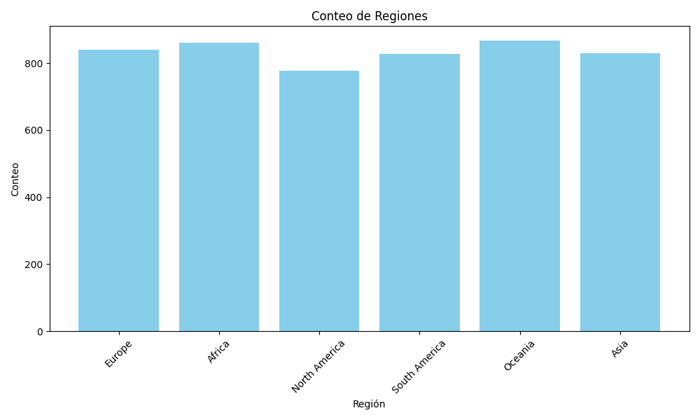
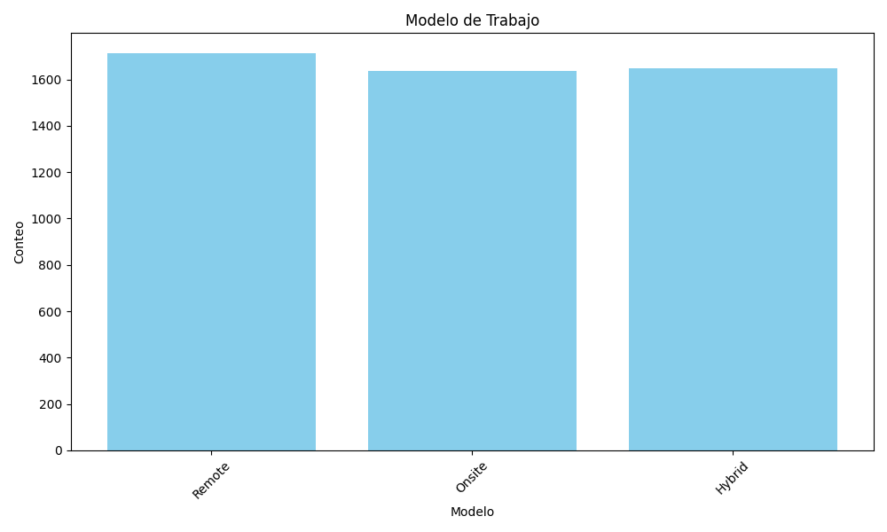

# Fuente

El archivo se obtuvo de la página web Kaggle.com y se llama _Remote Work & Mental Health_ https://www.kaggle.com/datasets/waqi786/remote-work-and-mental-health?select=Impact_of_Remote_Work_on_Mental_Health.csv actualizado durante septiembre del 2024

# Descripción de la información 

Se trata de una base de datos de 5k filas por 22 columnas, de las que tenemos:
 - Employee_ID: string (nullable = true)
 - Age: integer (nullable = true)
 - Gender: string (nullable = true)
 - Job_Role: string (nullable = true)
 - Industry: string (nullable = true)
 - Years_of_Experience: integer (nullable = true)
 - Work_Location: string (nullable = true)
 - Hours_Worked_Per_Week: integer (nullable = true)
 - Number_of_Virtual_Meetings: integer (nullable = true)
 - Work_Life_Balance_Rating: integer (nullable = true)
 - Stress_Level: string (nullable = true)
 - Mental_Health_Condition: string (nullable = true)
 - Access_to_Mental_Health_Resources: string (nullable = true)
 - Productivity_Change: string (nullable = true)
 - Social_Isolation_Rating: integer (nullable = true)
 - Satisfaction_with_Remote_Work: string (nullable = true)
 - Company_Support_for_Remote_Work: integer (nullable = true)
 - Physical_Activity: string (nullable = true)
 - Sleep_Quality: string (nullable = true)
 - Region: string (nullable = true) 

## Edades
|summary|              Age|
|-------|-----------------|
|  count|             5000|
|   mean|           40.995|
| stddev|11.29602120301673|
|    min|               22|
|    max|               60|

## Rol de trabajo

## Region

## Modelo de trabajo

